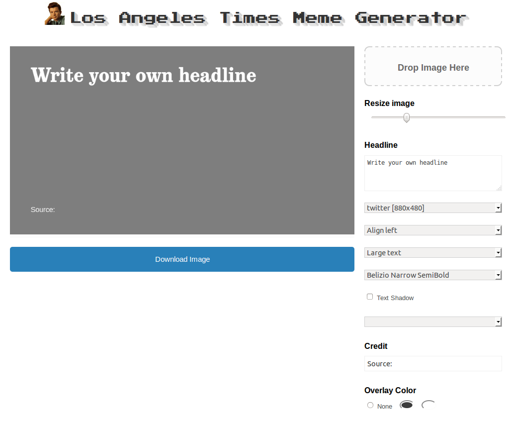

# Meme (Data Desk remix)

Meme is a generator that Vox Media uses to create social sharing images. See working version at [http://www.sbnation.com/a/meme](http://www.sbnation.com/a/meme).



This is the Los Angeles Times Data Desk's fork. Here is what we changed:

- Substituted in Los Angeles Times watermarks
- Created a new set of options to change the image's aspect ratio
- Added Los Angeles Times fonts
- Hosted as built static files inside our newsroom VPN


How to deploy (at the LA Times)
-------------------------------

**Edit the ``source`` directory to make the changes you want**

You can fire up the test server locally by running:

```bash
$ make serve
```

**Build the source files into a working static site**

Build your changes into static files like so:

```bash
$ make build
```

**Commit your work**

Use Git to commit your work to our repository.

```bash
# Add the changes
$ git add .
# Log your work
$ git commit -m "A precise message goes here"
# Push it up to GitHub
$ git push origin master
```

**Deploy your changes to our production server under Ben's desk**

```bash
$ fab deploy
```
